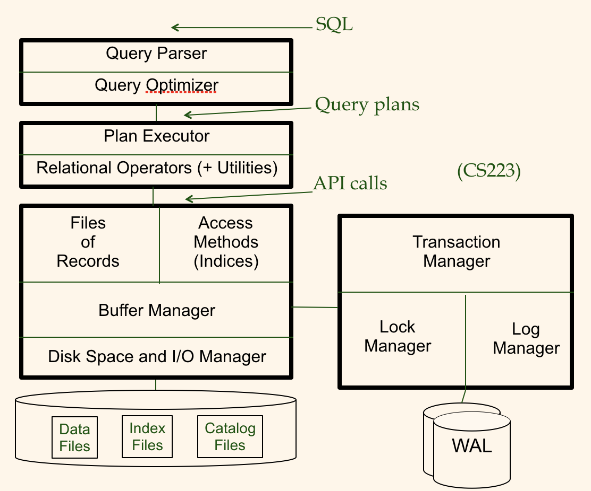

# UCI-cs222 Database Implementation 

1. cs222-database.xcodeproj dir contains IDE-related files.
2. FileManager implements page-oriented disk IO.
3. RelationManager implements record-oriented DB behavior such as insertion/deletion/scan.
4. IndexManager implements B+ tree based indexing.
5. cs222-database dir contains public/private test cases for FileManager/RelationManager/IndexManager.
6. Utils implments util functions. 
 
